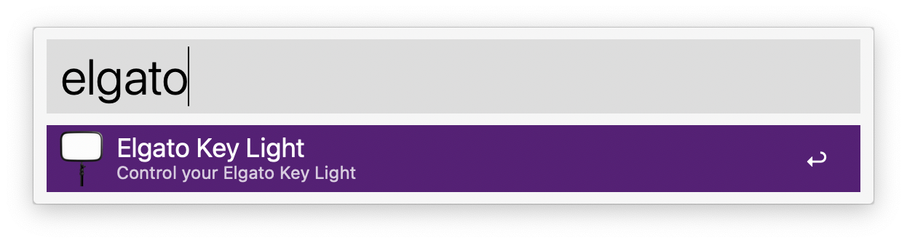
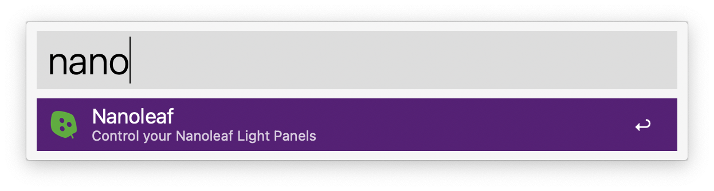
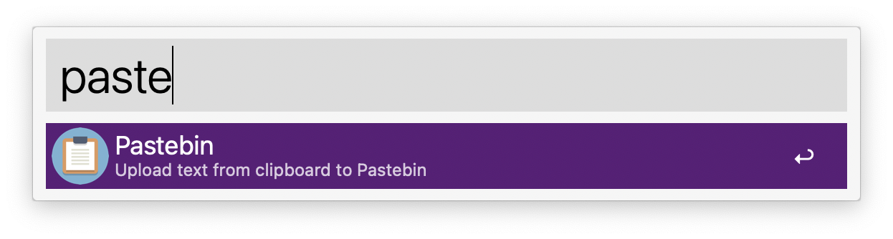
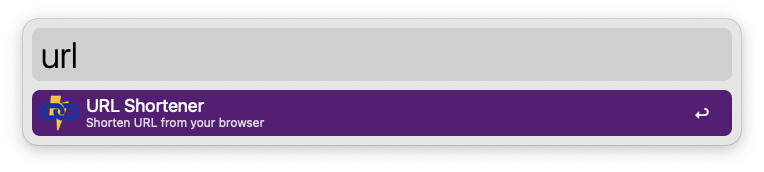
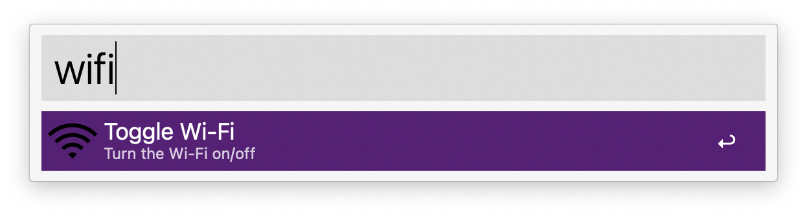

# Alfred Workflows

My collection of productivity-boosting [Alfred](https://www.alfredapp.com/powerpack/) Workflows. Remember to [set the necessary Workflow Environment Variables](https://www.alfredapp.com/help/workflows/advanced/variables/#environment).

## Elgato Key Light
Aliases: elgato, light
### Usage:
* `elgato`: Turn the light on/off
* `elgato b<1-9>`: Set the brightness level
* `elgato t<1-9>`: Set the temperature color

Requires [Elgato Key Light](https://www.elgato.com/en/key-light).

## Nanoleaf
Aliases: leaf, nano
### Usage:
* `nano`: Turn the light on/off
* `nano b<1-9>`: Set the brightness level
* `nano c<color>`: Set the color
* `nano s<scene>`: Set the scene

Requires [Nanoleaf Light Panels](https://nanoleaf.me/en-US/products/nanoleaf-light-panels).

## Pastebin
Aliases: paste, pb

Requires @mkaczanowski's [Pastebin](https://github.com/mkaczanowski/pastebin).

## URL Shortener
Aliases: link, shorten, url

Requires [Shlink](https://github.com/shlinkio/shlink). Supports fetching the URL only from Chrome and Safari.

## Wi-Fi Toggle

