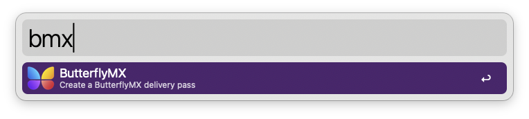
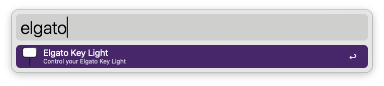
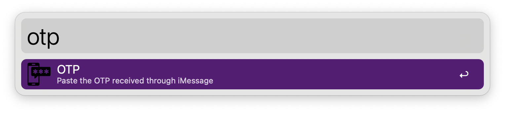
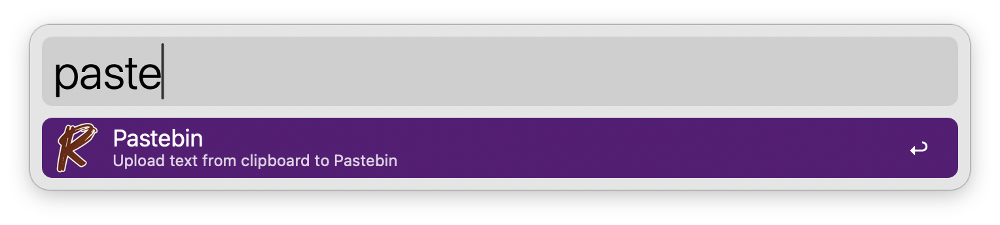
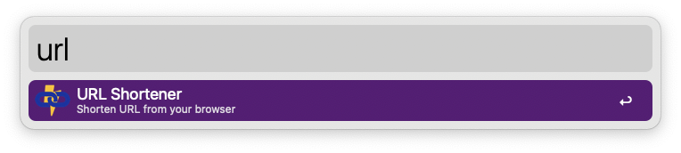
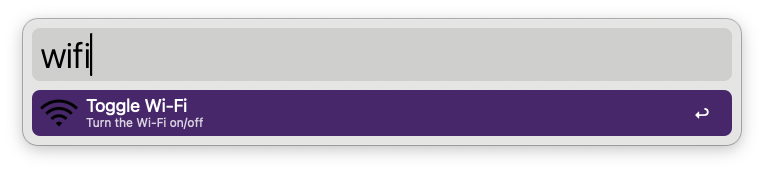

# Alfred Workflows

My collection of productivity-boosting [Alfred 5](https://www.alfredapp.com/powerpack/) Workflows. Remember to fill in the [Workflow Configuration](https://www.alfredapp.com/help/workflows/user-configuration/) when importing.

## ButterflyMX
Aliases: bmx, butterfly
### Usage:
* `bmx`: Create a delivery pass and copy its PIN
* `bmx <name>`: Create a delivery pass with a name for the access log

Requires [Home Assistant](https://www.home-assistant.io) with the [ButterflyMX integration](https://github.com/dkmcgowan/ha-butterflymx).

## Elgato Key Light
Aliases: elgato, light
### Usage:
* `elgato`: Turn the light on/off
* `elgato b<1-9>`: Set the brightness level
* `elgato t<1-9>`: Set the temperature color

Requires [Elgato Key Light](https://www.elgato.com/en/key-light).

## OTP
Aliases: 2fa, otp

Shortcut: <kbd>Ctrl</kbd> + <kbd>Cmd</kbd> + <kbd>O</kbd>

## Pastebin
Aliases: paste, pb

Requires [Pastebin](https://github.com/mkaczanowski/pastebin).

## URL Shortener
Aliases: link, shorten, url

Requires [Chhoto URL](https://github.com/SinTan1729/chhoto-url). Supports fetching the URL only from Chrome and Safari.

## Wi-Fi Toggle

