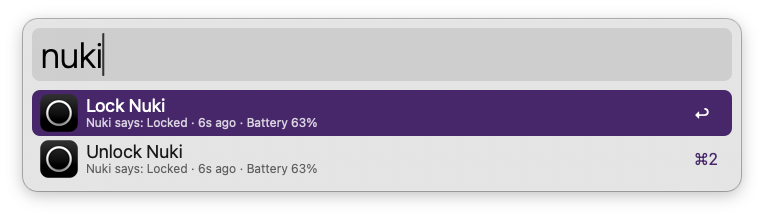

# Alfred Workflows

My collection of [Alfred 5](https://www.alfredapp.com/powerpack/) workflows. Remember to fill in the [Workflow Configuration](https://www.alfredapp.com/help/workflows/user-configuration/) when importing.

## ButterflyMX

**Aliases:** `bmx`, `butterfly`

**Usage:**
* `bmx`: Create a delivery pass and copy its PIN
* `bmx <name>`: Create a delivery pass with a name for the access log

Requires [Home Assistant](https://www.home-assistant.io) with the [ButterflyMX integration](https://github.com/dkmcgowan/ha-butterflymx).

## Elgato Key Light

**Aliases:** `elgato`, `light`

**Usage:**
* `elgato`: Turn the light on/off
* `elgato b<1-9>`: Set the brightness
* `elgato t<1-9>`: Set the color temperature

Requires an [Elgato Key Light](https://www.elgato.com/en/key-light).

## Nuki

**Aliases:** `door`, `nuki`

**Usage:**
* `nuki`: Lock or unlock the door; shows the last reported state and battery level

Requires a [Nuki Smart Lock](https://nuki.io) with built-in Wi-Fi and [MQTT](https://help.nuki.io/hc/en-us/articles/14052016143249) enabled.

## OTP

**Aliases:** `2fa`, `otp`

**Shortcut:** <kbd>Ctrl</kbd> + <kbd>Cmd</kbd> + <kbd>O</kbd>

**Usage:**
* `otp`: Type the latest OTP received through Messages and press Return

## Pastebin

**Aliases:** `paste`, `pb`

**Usage:**
* `pb`: Upload the clipboard text and copy the paste URL

Requires [Rustypaste](https://github.com/orhun/rustypaste).

## URL Shortener

**Aliases:** `link`, `shorten`, `url`

**Usage:**
* `url`: Shorten the current tab's URL and copy it

Requires [Chhoto URL](https://github.com/SinTan1729/chhoto-url). Works only when the default browser is Chrome or Safari.

## Wi-Fi Toggle

**Aliases:** `wifi`

**Usage:**
* `wifi`: Turn the Wi-Fi on/off

